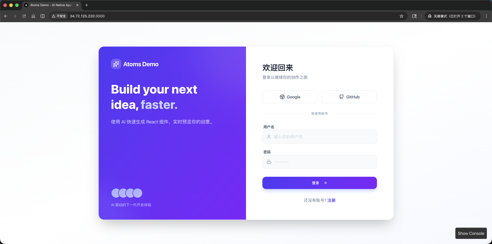
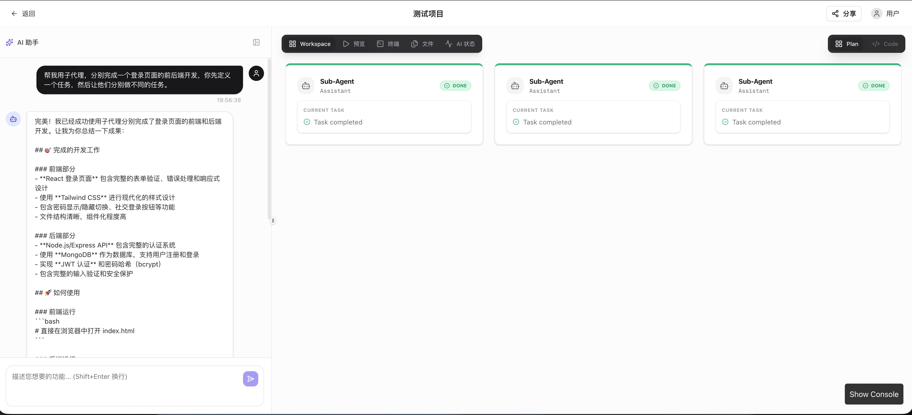
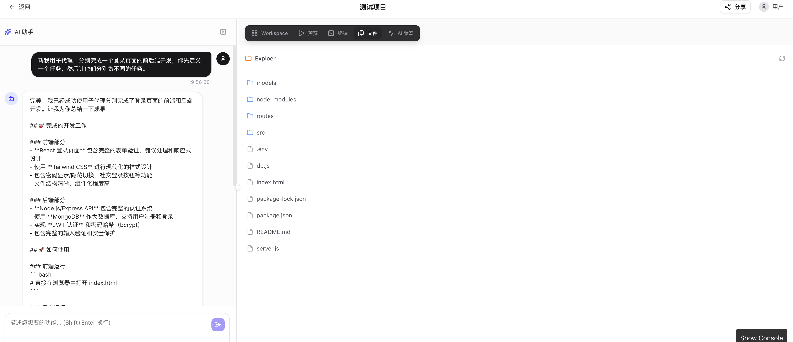
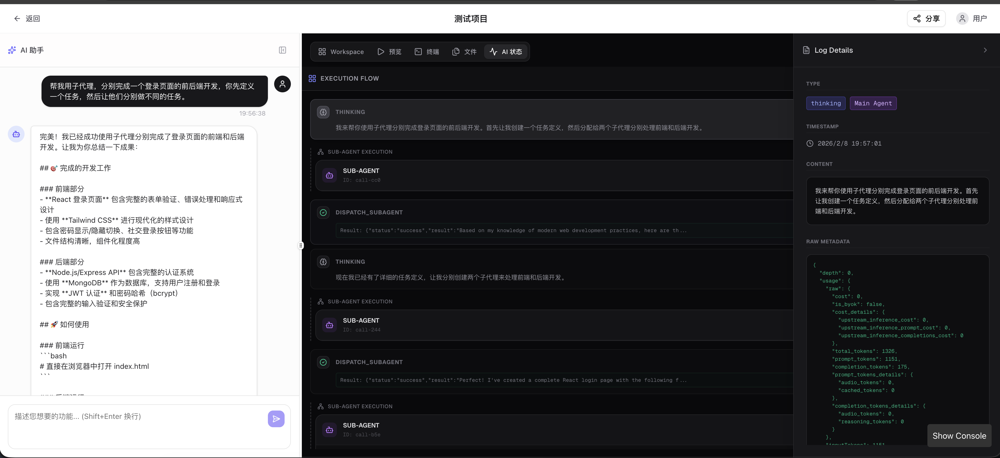
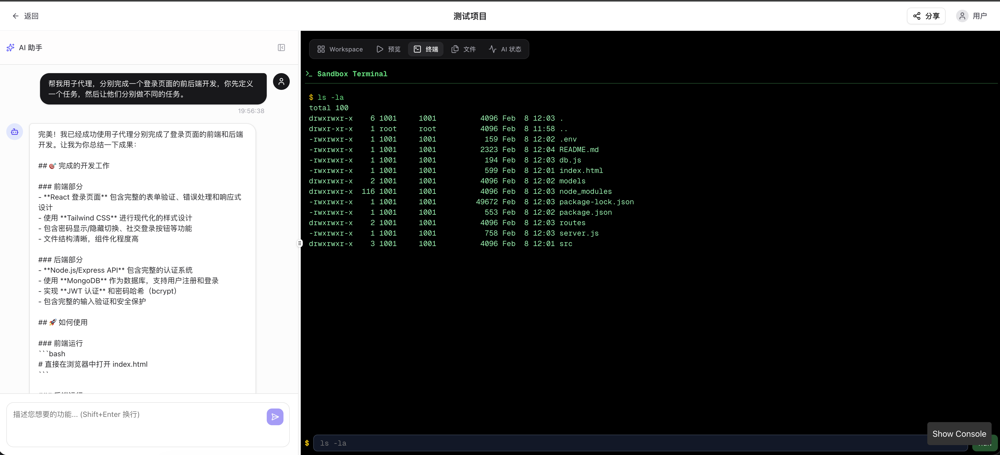
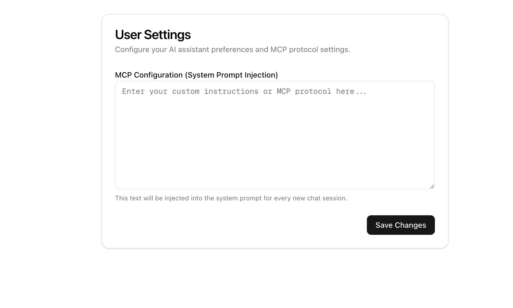

# Atoms Demo

> 🚀 AI 驱动的全栈 Web 应用开发平台

一个类似 [Atoms](https://atoms.ai) 的 AI Native 应用构建器，通过自然语言对话驱动代码生成，并提供实时预览和沙盒执行环境。


- **线上预览**: [http://34.72.125.220:3000](http://34.72.125.220:3000)

## 📺 功能演示

| 登录与认证 | 界面概览 |
|:---:|:---:|
|  |  |

| 侧边栏与历史 | AI 思考过程 |
|:---:|:---:|
|  |  |

| 分享与预览 | |
|:---:|:---:|
|  | |

> [!NOTE]
> 自定义设置提示词/mcp等功能 

---

## 🏗️ 项目架构

```
┌─────────────────────────────────────────────────────────────────┐
│                         用户浏览器                               │
├─────────────────────────────────────────────────────────────────┤
│                                                                 │
│  ┌─────────────┐  ┌─────────────┐  ┌─────────────────────────┐  │
│  │  Dashboard  │  │    Chat     │  │       Preview           │  │
│  │  项目列表    │  │   AI对话    │  │  Sandpack / 无限画布    │  │
│  └─────────────┘  └─────────────┘  └─────────────────────────┘  │
│                                                                 │
└───────────────────────────┬─────────────────────────────────────┘
                            │
                            ▼
┌─────────────────────────────────────────────────────────────────┐
│                    Next.js 14 App Router                        │
├─────────────────────────────────────────────────────────────────┤
│                                                                 │
│  ┌─────────────┐  ┌─────────────┐  ┌─────────────────────────┐  │
│  │  API Routes │  │   AI SDK    │  │   Sandbox Manager       │  │
│  │  /api/*     │  │  OpenRouter │  │   Docker 容器管理        │  │
│  └─────────────┘  └─────────────┘  └─────────────────────────┘  │
│                                                                 │
└───────────────────────────┬─────────────────────────────────────┘
                            │
              ┌─────────────┴─────────────┐
              ▼                           ▼
┌─────────────────────────┐   ┌───────────────────────────┐
│      Supabase           │   │    Docker Containers      │
│  ┌─────────────────┐    │   │   ┌───────────────────┐   │
│  │   PostgreSQL    │    │   │   │ sandbox-{userId}  │   │
│  │   users         │    │   │   │ (atoms-sandbox)   │   │
│  │   projects      │    │   │   └───────────────────┘   │
│  │   messages      │    │   │   ┌───────────────────┐   │
│  │   deployments   │    │   │   │ sandbox-{userId}  │   │
│  └─────────────────┘    │   │   │     ...           │   │
│  ┌─────────────────┐    │   │   └───────────────────┘   │
│  │   Auth (GoTrue) │    │   │        (最多 5 个)        │
│  └─────────────────┘    │   │                           │
└─────────────────────────┘   └───────────────────────────┘
```

---

## ✨ 核心功能

### 🤖 AI 代码生成
- 通过自然语言描述需求，AI 自动生成完整的 Web 应用代码
- 支持多模型切换（通过 OpenRouter 聚合）
- 多步工具调用：执行命令、读写文件、查看目录等
- 实时流式传输，即时展示 AI 思考过程

### 👁️ 实时代码预览
- 基于 Sandpack 的即时预览
- 支持 HTML/CSS/JavaScript/React 项目
- 代码编辑与预览视图切换
- 无限画布：支持拖拽和缩放

### 🐳 隔离沙盒环境
- 每个项目独立的 Docker 容器
- Web 终端：支持用户和 AI 执行 Bash 命令
- 文件浏览器：查看项目文件结构
- 自动生命周期管理（2小时空闲自动终止）

### 📤 一键发布分享
- 生成公开分享链接
- 支持聊天预览和网页预览两种模式
- 无需登录即可访问分享内容

### 🔐 用户认证
- 极简登录/注册流程
- 基于 Supabase Auth 的会话管理
- 项目数据持久化

---

## 🛠️ 技术栈

| 类别 | 技术 | 说明 |
|------|------|------|
| **前端框架** | Next.js 14 | App Router + Server Actions |
| **语言** | TypeScript | 类型安全 |
| **UI 组件** | Shadcn UI | 基于 Radix UI |
| **样式** | Tailwind CSS v4 | 原子化 CSS |
| **代码预览** | Sandpack | CodeSandbox 官方组件 |
| **动画** | Framer Motion | 流畅动画效果 |
| **数据库** | PostgreSQL | Supabase 托管 |
| **认证** | Supabase Auth | 开箱即用 |
| **AI 接口** | OpenRouter | 多模型聚合 |
| **AI SDK** | Vercel AI SDK | 流式传输支持 |
| **容器** | Docker | 沙盒隔离 |

---

## 🚀 快速开始

### 环境要求

- Node.js 20+
- Docker (用于沙盒功能)
- Supabase 账号 (或自托管)

### 本地开发

```bash
# 克隆仓库
git clone https://github.com/likecu/atoms-demos.git
cd atoms-demo

# 安装依赖
npm install

# 配置环境变量
cp .env.example .env.local
# 编辑 .env.local 填入你的配置

# 启动开发服务器
npm run dev
```

访问 http://localhost:3000

### Docker 部署

```bash
# 构建并启动
docker-compose up -d

# 查看日志
docker-compose logs -f
```

详细部署说明请参阅 [DEPLOYMENT.md](./DEPLOYMENT.md)

---

## 📁 项目结构

```
atoms-demo/
├── src/
│   ├── app/                    # Next.js App Router
│   │   ├── api/                # API 路由
│   │   │   ├── chat/           # 聊天 API
│   │   │   ├── publish/        # 发布 API
│   │   │   └── sandbox/        # 沙盒 API
│   │   ├── auth/               # 认证页面
│   │   ├── chat/[id]/          # 聊天页面
│   │   ├── dashboard/          # 仪表盘
│   │   └── share/              # 分享页面
│   ├── components/             # React 组件
│   │   ├── chat/               # 聊天相关组件
│   │   ├── preview/            # 预览相关组件
│   │   ├── sandbox/            # 沙盒相关组件
│   │   └── ui/                 # UI 基础组件
│   └── lib/                    # 工具库
│       ├── ai/                 # AI 集成
│       ├── sandbox/            # 沙盒管理
│       └── supabase/           # 数据库客户端
├── docker-compose.yml          # Docker 编排
├── Dockerfile                  # 主应用镜像
└── DEPLOYMENT.md               # 部署文档
```

---

## 📊 数据库设计

| 表名 | 说明 |
|------|------|
| `users` | 用户信息 |
| `projects` | 项目/会话 |
| `messages` | 对话消息 |
| `deployments` | 发布记录 |
| `artifacts` | 代码产物 |
| `ai_call_logs` | AI 调用日志 |

---

## 🌟 功能亮点

### 1. AI 状态透明化
实时展示 AI 的思考过程和工具调用流程，让用户清楚了解 AI 正在做什么。

### 2. 智能沙盒管理
- 最多 5 个并发沙盒，超出时 LRU 淘汰
- 2 小时空闲自动终止
- 输出截断保护，防止系统崩溃

### 3. 无限画布
支持拖拽和缩放的预览画布，提供类似 Figma 的交互体验。

### 4. 异步处理架构
后端异步 + 前端轮询，解决长文本生成的超时问题。

---

## 👨‍💻 开发过程与思考

### 💡 实现思路与关键取舍

1. **深度调研与设计**：
   - 项目启动阶段，利用 **Google Gemini** 对竞品（Atoms.dev, v0.dev）进行深度调研。
   - 输出了详尽的 [**产品设计文档**](./任务分析)，明确了“氛围编程”（Vibe Coding）的核心理念和架构方向。

2. **AI-Native 开发流程**：
   - **核心工具**：使用 **Antigravity** 作为主要开发助手。
   - **迭代模式**：采用 **"Human-in-the-loop"** 工作流。
     - 手动执行业务流程 -> 截图记录异常 -> 让 AI 基于视觉反馈进行修复。
   - **关键取舍**：
     - **后端**：选择 **Supabase** 而非自建，以快速实现 Auth 和 DB，将精力集中在 AI 编排上。
     - **沙盒**：选择 **Docker** 容器方案而非 WebContainers，虽然部署稍重，但提供了更完整的环境隔离和后端语言支持（如 Python）。

### ✅ 当前完成程度

详细进度可查阅 [**任务完成情况**](./任务文档/任务完成情况.md) 与 [**已完成功能归档**](./任务文档/已完成功能/)。


### 📈 未来扩展与优先级

如果继续投入时间，我将按照以下优先级进行扩展：

1. **P0: 体验与稳定性优化**
   - 优化 Sandpack 的依赖加载速度，引入 CDN 缓存。
   - 增强 WebSocket 连接的稳定性，处理断网重连机制。

2. **P1: 多文件与复杂项目支持**
   - 目前主要支持单文件组件，下一步将引入完整的文件树系统。
   - 支持多文件相互引用和复杂的 package.json 依赖管理。

3. **P2: 视觉反馈闭环 (Visual Self-Correction)**
   - 引入多模态模型（GPT-4o/Claude 3.5 Sonnet），让 AI "看" 到预览区的报错或样式问题。
   - 自动发起修复建议，真正实现"闭环"的自动编程。

4. **P3: 社区协作生态**
   - 增加 Project Fork 功能，允许基于他人的项目进行二次开发。
   - 引入社区模版库，降低冷启动门槛。

---

## 🔧 环境变量

```env
# Supabase 配置
NEXT_PUBLIC_SUPABASE_URL=your-supabase-url
NEXT_PUBLIC_SUPABASE_ANON_KEY=your-anon-key
SUPABASE_SERVICE_ROLE_KEY=your-service-role-key

# 认证密钥 (至少 32 字符)
AUTH_SECRET=your-auth-secret

# 应用配置
NEXT_PUBLIC_APP_URL=http://localhost:3000

# AI 模型配置
OPENROUTER_API_KEY=your-openrouter-key
GEMINI_MODEL_ID=your-model-id

# 沙盒配置
WORKSPACE_ROOT=/app/workspaces
```

---

## 📝 API 接口

| 接口 | 方法 | 说明 |
|------|------|------|
| `/api/chat` | POST | 发送消息给 AI |
| `/api/chat/status` | GET | 获取 AI 响应状态 |
| `/api/projects` | GET/POST | 项目管理 |
| `/api/publish` | POST | 发布项目 |
| `/api/sandbox/exec` | POST | 执行沙盒命令 |
| `/api/sandbox/files` | GET | 获取文件列表 |

---

## 📄 许可证

MIT License

---

## 🙏 致谢

- [Atoms](https://atoms.ai) - 灵感来源
- [Vercel AI SDK](https://sdk.vercel.ai/) - AI 集成
- [Sandpack](https://sandpack.codesandbox.io/) - 代码预览
- [Shadcn UI](https://ui.shadcn.com/) - UI 组件
- [Supabase](https://supabase.com/) - 后端服务
