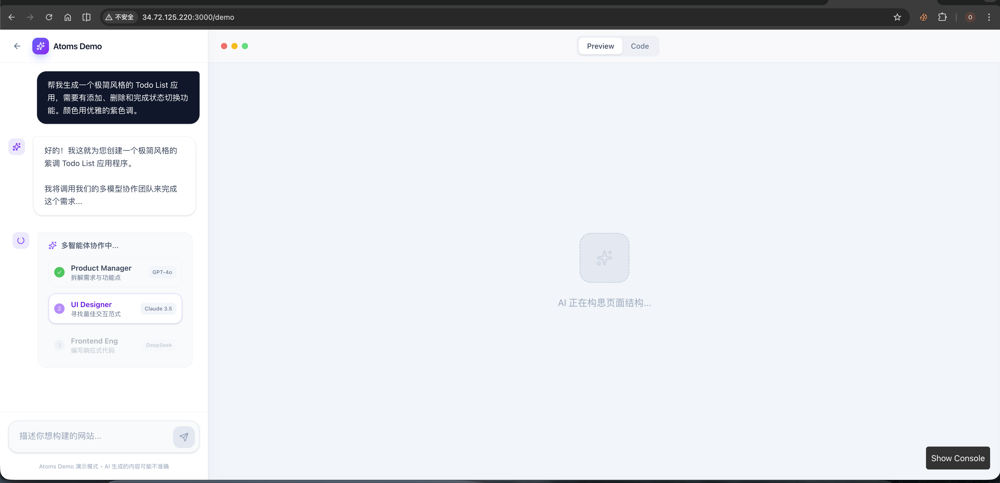
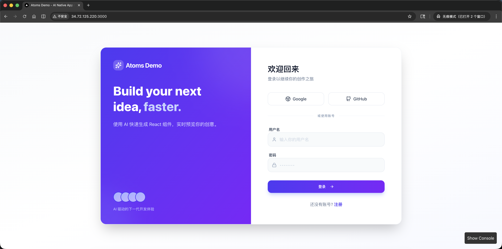
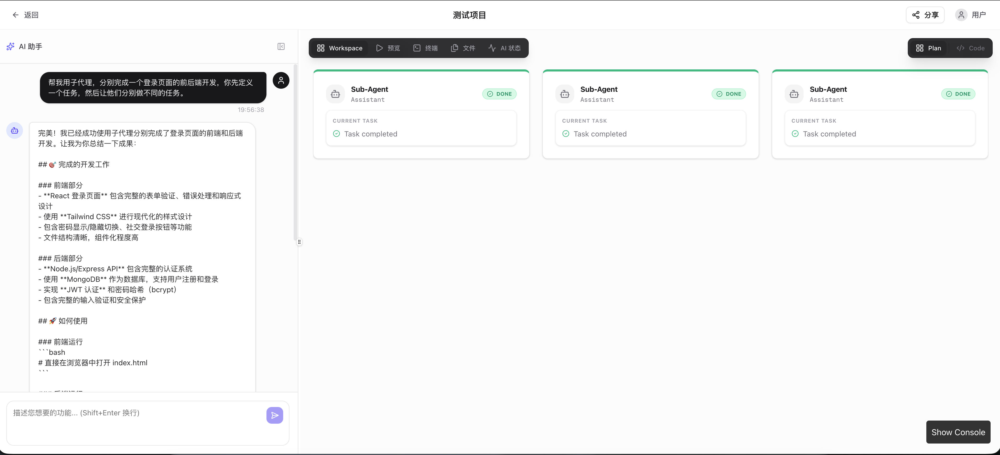
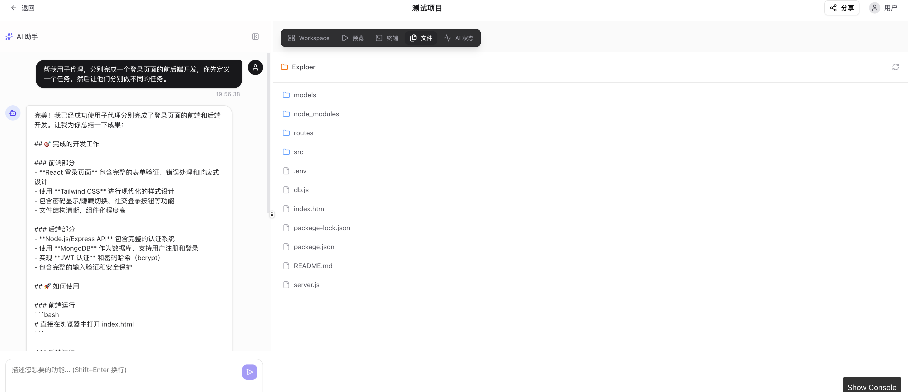
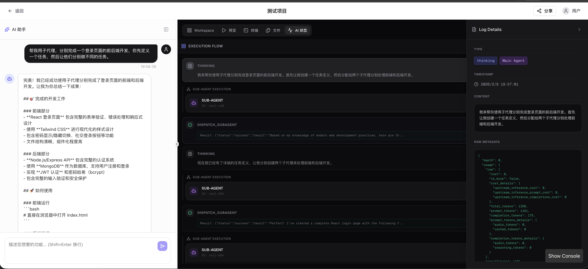
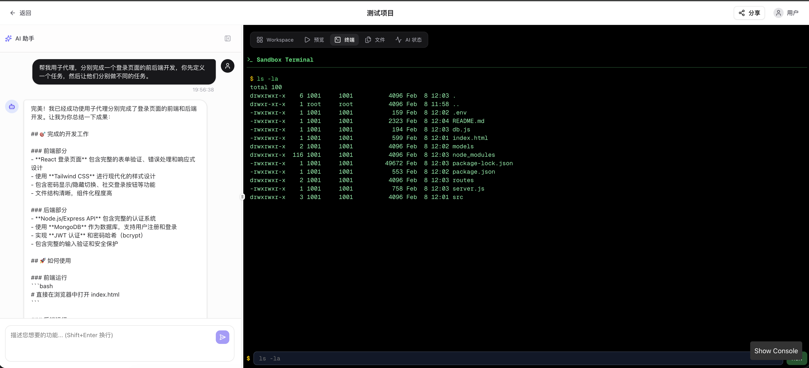
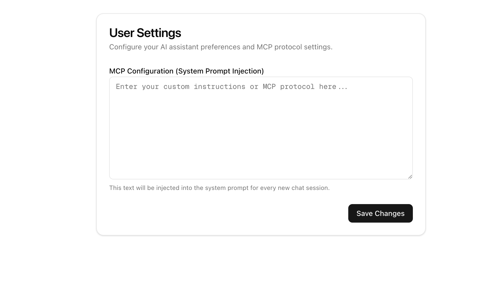

# Atoms Demo

> 🚀 AI 驱动的全栈 Web 应用开发平台

一个类似 [Atoms](https://atoms.ai) 的 AI Native 应用构建器，通过自然语言对话驱动代码生成，并提供实时预览和沙盒执行环境。


- **线上预览**: [http://34.72.125.220:3000](http://34.72.125.220:3000)
- **演示 Demo**: [http://34.72.125.220:3000/demo](http://34.72.125.220:3000/demo) — 多智能体协作演示，无需登录即可体验

| 演示 Demo 界面 |
|:---:|
|  |

## 📺 功能演示

| 登录与认证 | 界面概览 |
|:---:|:---:|
|  |  |

| 侧边栏与历史 | AI 思考过程 |
|:---:|:---:|
|  |  |

| 分享与预览 | |
|:---:|:---:|
|  | |

> [!NOTE]
> 自定义设置提示词/mcp等功能 

---

## 🏗️ 项目架构

```
┌─────────────────────────────────────────────────────────────────┐
│                         用户浏览器                               │
├─────────────────────────────────────────────────────────────────┤
│                                                                 │
│  ┌─────────────┐  ┌─────────────┐  ┌─────────────────────────┐  │
│  │  Dashboard  │  │    Chat     │  │       Preview           │  │
│  │  项目列表    │  │   AI对话    │  │  Sandpack / 无限画布    │  │
│  └─────────────┘  └─────────────┘  └─────────────────────────┘  │
│                                                                 │
│  ┌─────────────┐  ┌─────────────┐  ┌─────────────────────────┐  │
│  │  Settings   │  │    Demo     │  │       Share             │  │
│  │  MCP 配置   │  │  多Agent演示│  │  公开分享预览           │  │
│  └─────────────┘  └─────────────┘  └─────────────────────────┘  │
│                                                                 │
└───────────────────────────┬─────────────────────────────────────┘
                            │
                            ▼
┌─────────────────────────────────────────────────────────────────┐
│                    Next.js 16 App Router                        │
├─────────────────────────────────────────────────────────────────┤
│                                                                 │
│  ┌─────────────┐  ┌──────────────┐  ┌────────────────────────┐  │
│  │  API Routes │  │  Vercel AI   │  │  Sandbox Manager       │  │
│  │  7 个模块   │  │  SDK v6      │  │  Dockerode 容器管理    │  │
│  │             │  │  + OpenRouter│  │                        │  │
│  └─────────────┘  └──────────────┘  └────────────────────────┘  │
│                                                                 │
│  ┌─────────────────────────────────────────────────────────────┐│
│  │              递归 Agent 架构                                ││
│  │  Main Agent ──→ dispatch_subagent ──→ Sub-Agent            ││
│  │  (researcher / coder / critic / planner)                   ││
│  │  最大递归深度: 3 层 │ 每轮最多 30 步                       ││
│  └─────────────────────────────────────────────────────────────┘│
│                                                                 │
└───────────────────────────┬─────────────────────────────────────┘
                            │
              ┌─────────────┴─────────────┐
              ▼                           ▼
┌─────────────────────────┐   ┌───────────────────────────┐
│      Supabase           │   │    Docker Containers      │
│  ┌─────────────────┐    │   │   ┌───────────────────┐   │
│  │   PostgreSQL    │    │   │   │ sandbox-{userId}  │   │
│  │   users         │    │   │   │ (alpine + sh)     │   │
│  │   projects      │    │   │   └───────────────────┘   │
│  │   messages      │    │   │   最多 5 个并发            │
│  │   ai_call_logs  │    │   │   2h 空闲自动回收         │
│  │   deployments   │    │   │   1MB 输出截断保护        │
│  │   artifacts     │    │   │   LRU 淘汰策略            │
│  └─────────────────┘    │   │                           │
│  ┌─────────────────┐    │   │                           │
│  │   Auth (GoTrue) │    │   │                           │
│  └─────────────────┘    │   │                           │
└─────────────────────────┘   └───────────────────────────┘
```

---

## ✨ 核心功能

### 🤖 递归 Agent + 多智能体协作
- 基于 Vercel AI SDK v6 的 `generateText` 实现递归 Agent 架构
- 通过 OpenRouter 聚合多模型（支持 Gemini / DeepSeek / 其他模型动态切换）
- 内置 `dispatch_subagent` 工具，支持 researcher / coder / critic / planner 四种角色协作
- 最大递归深度 3 层，每轮最多 30 步，含循环检测和智能停止
- 所有思考过程、工具调用、子代理执行均实时记录到 `ai_call_logs` 表

### 🛠️ 5 种内置 AI 工具
| 工具 | 说明 |
|------|------|
| `executeBash` | 在 Docker 沙盒中执行 Shell 命令 |
| `readFile` | 读取工作区文件内容 |
| `writeFile` | 创建或修改文件（含路径安全校验） |
| `listFiles` | 列出目录内容 |
| `search_web` | 联网搜索获取最新信息 |

### 👁️ 实时代码预览
- 基于 Sandpack (CodeSandbox 官方组件) 的即时预览
- 客户端 React 运行时预览（`client-react-preview`）
- 代码编辑器视图 + 编排视图（`orchestration-view`）
- 无限画布：支持拖拽和缩放（`draggable-canvas`）

### 🐳 Docker 沙盒隔离
- 使用 Dockerode 管理每个用户独立的容器（`SandboxManager` 单例模式）
- 最多 5 个并发沙盒，超出时 LRU 淘汰最不活跃的容器
- 2 小时空闲自动停止回收，1MB 输出截断保护
- 文件浏览器：递归列出项目文件结构（跳过 `.git` 和 `node_modules`）

### 📤 一键发布分享
- 生成公开分享链接
- 支持聊天预览（`share-with-chat`）和网页预览（`share-preview`）两种模式
- 无需登录即可访问分享内容

### ⚙️ 用户设置 (MCP 配置)
- Settings 页面支持用户自定义 MCP 协议提示词
- 配置内容自动注入到每次 AI 对话的 System Prompt 中
- 可用于个性化 AI 行为、预设开发规范等

### 🔐 用户认证
- 完整的登录/注册/登出流程（API: `/api/auth/login`, `/api/auth/register`, `/api/auth/logout`, `/api/auth/me`）
- 基于 Supabase Auth + SSR 的会话管理
- Next.js Middleware 路由保护（`/dashboard`、`/chat` 需登录；`/share` 公开访问）

---

## 🛠️ 技术栈

| 类别 | 技术 | 版本 | 说明 |
|------|------|------|------|
| **前端框架** | Next.js | 16.1.6 | App Router + Server Actions |
| **React** | React | 19.2.3 | 最新版 |
| **语言** | TypeScript | 5.x | 类型安全 |
| **UI 组件** | Radix UI | 1.4.3 | 无障碍原语组件 |
| **样式** | Tailwind CSS | v4 | 原子化 CSS |
| **代码预览** | Sandpack | 2.20.0 | CodeSandbox 官方组件 |
| **动画** | Framer Motion | 12.33.0 | 流畅动画效果 |
| **图表** | Recharts | 3.7.0 | React 图表库 |
| **表单** | React Hook Form + Zod | 7.x + 4.x | 类型安全表单验证 |
| **数据库** | PostgreSQL | - | Supabase 托管 |
| **认证** | Supabase Auth + SSR | 0.8.0 | 服务端渲染认证 |
| **AI 接口** | OpenRouter | 2.1.1 | `@openrouter/ai-sdk-provider` |
| **AI SDK** | Vercel AI SDK | 6.0.77 | `generateText` + `tool()` |
| **容器管理** | Dockerode | 4.0.9 | Node.js Docker API 客户端 |
| **面板布局** | react-resizable-panels | 4.6.2 | 可调整面板 |

---

## 🚀 快速开始

### 环境要求

- Node.js 20+
- Docker (用于沙盒功能)
- Supabase 账号 (或自托管)

### 本地开发

```bash
# 克隆仓库
git clone https://github.com/likecu/atoms-demos.git
cd atoms-demo

# 安装依赖
npm install

# 配置环境变量
cp .env.example .env.local
# 编辑 .env.local 填入你的配置

# 启动开发服务器
npm run dev
```

访问 http://localhost:3000

### Docker 部署

```bash
# 构建并启动
docker-compose up -d

# 查看日志
docker-compose logs -f
```

详细部署说明请参阅 [DEPLOYMENT.md](./atoms-demo/DEPLOYMENT.md)

---

## 📁 项目结构

```
atoms-demo/
├── src/
│   ├── app/                        # Next.js 16 App Router
│   │   ├── api/                    # API 路由 (7 个模块)
│   │   │   ├── auth/               # 认证 (login/register/logout/me)
│   │   │   ├── chat/               # 聊天 API + AI Agent + Tools
│   │   │   ├── files/              # 文件操作 API
│   │   │   ├── messages/           # 消息查询 API
│   │   │   ├── preview/            # 预览 API
│   │   │   ├── projects/           # 项目管理 API
│   │   │   └── publish/            # 发布 API
│   │   ├── auth/                   # 认证页面 (登录/注册)
│   │   ├── chat/[id]/              # 聊天页面
│   │   ├── chat-new/               # 新建聊天
│   │   ├── dashboard/              # 项目仪表盘
│   │   ├── demo/                   # 多智能体演示页面
│   │   ├── settings/               # 用户设置 (MCP 配置)
│   │   └── share/                  # 分享页面
│   ├── components/                 # React 组件 (10 个模块)
│   │   ├── chat/                   # AI 状态面板/对话区/文件浏览器/分享对话框/Demo布局
│   │   ├── preview/                # Sandpack预览/React运行时预览/分享预览
│   │   ├── workspace/              # 编辑器/文件树/编排视图/流式编辑器
│   │   ├── ui/                     # 12 个基础 UI 组件 (基于 Radix UI)
│   │   ├── dashboard/              # 仪表盘组件
│   │   ├── layout/                 # 布局组件
│   │   ├── landing/                # 着陆页
│   │   ├── sandbox/                # 沙盒组件
│   │   ├── auth/                   # 认证组件
│   │   └── debug/                  # 调试组件
│   ├── lib/                        # 工具库
│   │   ├── actions/                # Server Actions (files/message/project/sandbox/user)
│   │   ├── sandbox/                # SandboxManager + 配置
│   │   ├── context.tsx             # 全局 Context
│   │   ├── workspace-context.tsx   # 工作区 Context (AgentNode 状态管理)
│   │   ├── auth-context.tsx        # 认证 Context
│   │   ├── project-context.tsx     # 项目 Context
│   │   ├── demo-data.ts            # Demo 演示脚本数据
│   │   └── log-parser.ts           # AI 日志解析器
│   └── middleware.ts               # 路由保护中间件
├── docker-compose.yml              # Docker 编排
├── Dockerfile                      # 主应用镜像
├── deploy.sh                       # 一键部署脚本 (含热补丁)
└── DEPLOYMENT.md                   # 部署文档
```

---

## 📊 数据库设计

| 表名 | 说明 |
|------|------|
| `users` | 用户信息 + MCP 配置 |
| `projects` | 项目/会话 |
| `messages` | 对话消息 |
| `ai_call_logs` | AI 调用日志（含 agent_label、step_type、parent 关联） |
| `deployments` | 发布记录 |
| `artifacts` | 代码产物 |

---

## 🌟 功能亮点

### 1. 递归 Agent + Subagent 调度
不同于简单的 LLM 调用，实现了真正的递归 Agent 架构。Main Agent 可通过 `dispatch_subagent` 工具调度子代理执行专项任务，子代理结果自动回传主代理。所有执行日志通过 `parent_log_id` 形成树状结构，前端通过 `ai-status-panel` 实时可视化。

### 2. 智能沙盒管理
- `SandboxManager` 单例模式，Dockerode API 管理容器全生命周期
- 最多 5 个并发沙盒，超出时 LRU 淘汰
- 2 小时空闲自动终止（每 5 分钟检查一次）
- 1MB 输出截断保护，防止系统崩溃
- 路径安全校验，防止越权访问

### 3. AI 执行过程透明化
实时展示 AI 的思考过程、工具调用参数和结果，支持日志树状展开/折叠。通过 `buildLogTree` 构建层级关系，支持 Agent Card 和 Swimlane 两种渲染模式。

### 4. 异步处理架构
后端异步 + 前端轮询。`POST /api/chat` 立即返回 `202 Accepted`，后台异步执行 Agent 逻辑，日志实时写入数据库，前端通过 `/api/chat/status` 轮询获取最新执行状态。

---

## 👨‍💻 开发过程与思考

### 💡 实现思路与关键取舍

1. **深度调研与设计**：
   - 项目启动阶段，利用 **Google Gemini** 对竞品（Atoms.dev, v0.dev）进行深度调研。
   - 输出了详尽的 [**产品设计文档**](./任务分析)，明确了"氛围编程"（Vibe Coding）的核心理念和架构方向。

2. **AI-Native 开发流程**：
   - **核心工具**：使用 **Antigravity** 作为主要开发助手。
   - **迭代模式**：采用 **"Human-in-the-loop"** 工作流。
     - 手动执行业务流程 -> 截图记录异常 -> 让 AI 基于视觉反馈进行修复。
   - **关键取舍**：
     - **后端**：选择 **Supabase** 而非自建，以快速实现 Auth 和 DB，将精力集中在 AI 编排上。
     - **沙盒**：选择 **Docker + Dockerode** 容器方案而非 WebContainers，虽然部署稍重，但提供了更完整的环境隔离和后端语言支持（如 Python）。
     - **AI 接口**：选择 **OpenRouter** 聚合层而非直接对接单一模型 API，实现模型热切换。

### ✅ 当前完成程度

详细进度可查阅 [**任务完成情况**](./任务文档/任务完成情况.md) 与 [**已完成功能归档**](./任务文档/已完成功能/)。

### 📈 未来扩展与优先级

如果继续投入时间，我将按照以下优先级进行扩展：

1. **P0: 实时渲染稳定性**
   - 目前服务端渲染预览尚不稳定，需要优化 React 运行时预览的可靠性

2. **P1: 多文件与复杂项目支持**
   - 目前主要支持单文件组件，下一步将引入完整的文件树系统
   - 支持多文件相互引用和复杂的 package.json 依赖管理

3. **P2: 视觉反馈闭环 (Visual Self-Correction)**
   - 引入多模态模型，让 AI "看" 到预览区的报错或样式问题
   - 自动发起修复建议，真正实现"闭环"的自动编程

4. **P3: 社区协作生态**
   - 增加 Project Fork 功能，允许基于他人的项目进行二次开发
   - 引入社区模版库，降低冷启动门槛

---

## 🔧 环境变量

```env
# Supabase 配置
NEXT_PUBLIC_SUPABASE_URL=your-supabase-url
NEXT_PUBLIC_SUPABASE_ANON_KEY=your-anon-key
SUPABASE_SERVICE_ROLE_KEY=your-service-role-key

# 认证密钥 (至少 32 字符)
AUTH_SECRET=your-auth-secret

# 应用配置
NEXT_PUBLIC_APP_URL=http://localhost:3000

# AI 模型配置 (通过 OpenRouter 聚合)
OPENROUTER_API_KEY=your-openrouter-key
GEMINI_MODEL_ID=your-model-id

# 沙盒配置
WORKSPACE_ROOT=/app/workspaces
MAX_SANDBOXES=5
```

---

## 📝 API 接口

| 接口 | 方法 | 说明 |
|------|------|------|
| `/api/auth/login` | POST | 用户登录 |
| `/api/auth/register` | POST | 用户注册 |
| `/api/auth/logout` | POST | 用户登出 |
| `/api/auth/me` | GET | 获取当前用户信息 |
| `/api/chat` | POST | 发送消息给 AI (返回 202，异步处理) |
| `/api/chat/status` | GET | 轮询 AI 响应状态和执行日志 |
| `/api/projects` | GET/POST | 项目管理 |
| `/api/messages` | GET | 获取对话消息 |
| `/api/files` | GET | 获取工作区文件 |
| `/api/publish` | POST | 发布项目 |
| `/api/preview` | GET | 获取预览内容 |

---

## 📄 许可证

MIT License

---

## 🙏 致谢

- [Atoms](https://atoms.ai) - 灵感来源
- [Vercel AI SDK](https://sdk.vercel.ai/) - AI 集成核心
- [OpenRouter](https://openrouter.ai/) - 多模型聚合
- [Sandpack](https://sandpack.codesandbox.io/) - 代码预览
- [Radix UI](https://www.radix-ui.com/) - 无障碍 UI 原语
- [Supabase](https://supabase.com/) - 后端服务
- [Dockerode](https://github.com/apocas/dockerode) - Docker API 客户端
